# Architecture Documentation

This document provides detailed architecture documentation for rkgw (Rust Kiro Gateway), including component diagrams, data flows, and implementation details.

## Table of Contents

- [High-Level Architecture](#high-level-architecture)
- [Request Flow](#request-flow)
- [Component Deep Dives](#component-deep-dives)
  - [Main Application](#1-main-application)
  - [Configuration](#2-configuration)
  - [Error Handling](#3-error-handling)
  - [Model Cache](#4-model-cache)
  - [Model Resolver](#5-model-resolver)
  - [Authentication](#6-authentication)
  - [HTTP Client](#7-http-client)
  - [Routes](#8-routes)
  - [Streaming](#9-streaming)
  - [Thinking Parser](#10-thinking-parser)
  - [Tokenizer](#11-tokenizer)
  - [Converters](#12-converters)
  - [Data Models](#13-data-models)
  - [Middleware](#14-middleware)
- [Quick Reference](#quick-reference)

---

## High-Level Architecture

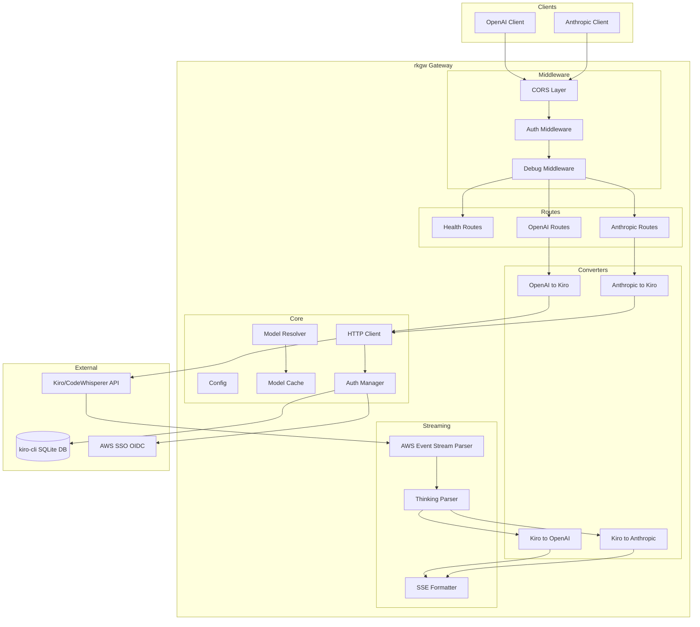

---

## Request Flow

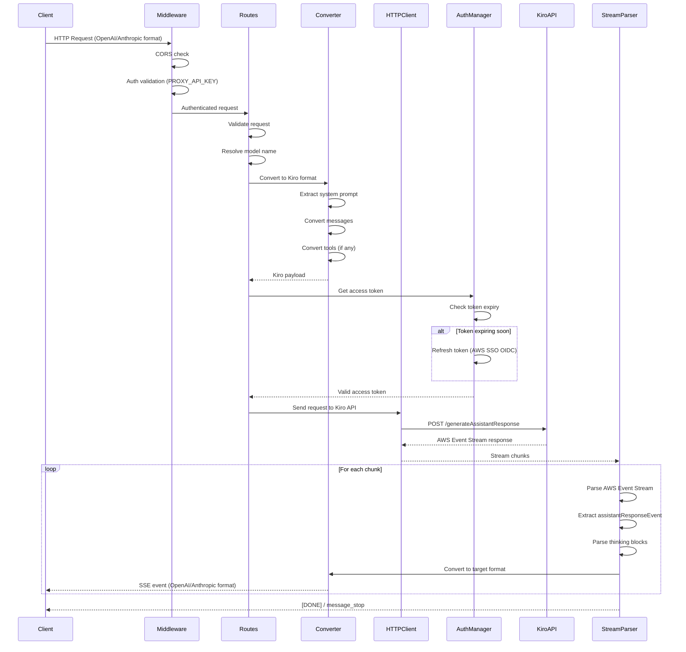

---

## Component Deep Dives

### 1. Main Application

**Source:** `src/main.rs`

**Overview:** Entry point that orchestrates startup, initializes all components, and runs the Axum HTTP server.

```mermaid
flowchart TD
    START[main()] --> LOAD[Load Config]
    LOAD --> VALIDATE[Validate Config]
    VALIDATE --> LOG[Initialize Logging]
    LOG --> AUTH[Create AuthManager]
    AUTH --> TOKEN[Test Authentication]
    TOKEN --> HTTP[Create HTTP Client]
    HTTP --> CACHE[Initialize Model Cache]
    CACHE --> MODELS[Load Models from Kiro API]
    MODELS --> HIDDEN[Add Hidden Models]
    HIDDEN --> RESOLVER[Create Model Resolver]
    RESOLVER --> STATE[Build AppState]
    STATE --> APP[Build Axum App]
    APP --> BIND[Bind to Address]
    BIND --> SERVE[Start Server]
    SERVE --> SHUTDOWN[Graceful Shutdown Handler]
```

**Key Functions:**
| Function | Description |
|----------|-------------|
| `main()` | Async entry point, orchestrates startup |
| `load_models_from_kiro()` | Fetches available models from Q API |
| `add_hidden_models()` | Adds model aliases not in API response |
| `build_app()` | Constructs Axum router with all routes and middleware |
| `shutdown_signal()` | Handles Ctrl+C and SIGTERM for graceful shutdown |

---

### 2. Configuration

**Source:** `src/config.rs`

**Overview:** Manages configuration from CLI arguments, environment variables, and `.env` files with priority: CLI > ENV > defaults.

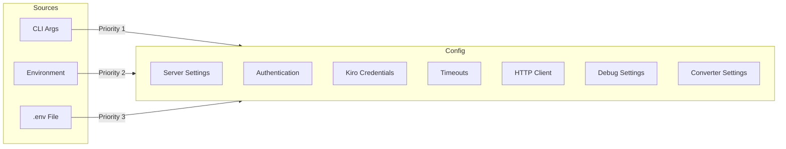

**Key Types:**

| Type | Description |
|------|-------------|
| `CliArgs` | Clap-derived CLI argument parser |
| `Config` | Complete configuration struct |
| `DebugMode` | Enum: `Off`, `Errors`, `All` |
| `FakeReasoningHandling` | Enum: `AsReasoningContent`, `Remove`, `Pass`, `StripTags` |

**Configuration Fields:**

| Field | Type | Default | Description |
|-------|------|---------|-------------|
| `server_host` | String | `0.0.0.0` | Server bind address |
| `server_port` | u16 | `8000` | Server port |
| `proxy_api_key` | String | Required | API key for client auth |
| `kiro_cli_db_file` | PathBuf | Required | Path to kiro-cli SQLite DB |
| `kiro_region` | String | `us-east-1` | AWS region |
| `token_refresh_threshold` | u64 | `300` | Seconds before expiry to refresh |
| `http_max_retries` | u32 | `3` | Max retry attempts |
| `fake_reasoning_enabled` | bool | `true` | Enable extended thinking |

---

### 3. Error Handling

**Source:** `src/error.rs`

**Overview:** Centralized error types with automatic HTTP response conversion via Axum's `IntoResponse` trait.

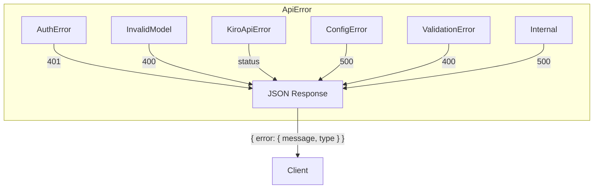

**Error Types:**

| Variant | HTTP Status | Description |
|---------|-------------|-------------|
| `AuthError` | 401 | Authentication failed |
| `InvalidModel` | 400 | Invalid model name |
| `KiroApiError` | varies | Error from Kiro API |
| `ConfigError` | 500 | Configuration error |
| `ValidationError` | 400 | Request validation failed |
| `Internal` | 500 | Internal server error |

---

### 4. Model Cache

**Source:** `src/cache.rs`

**Overview:** Thread-safe in-memory cache for model metadata using `DashMap` for concurrent access.

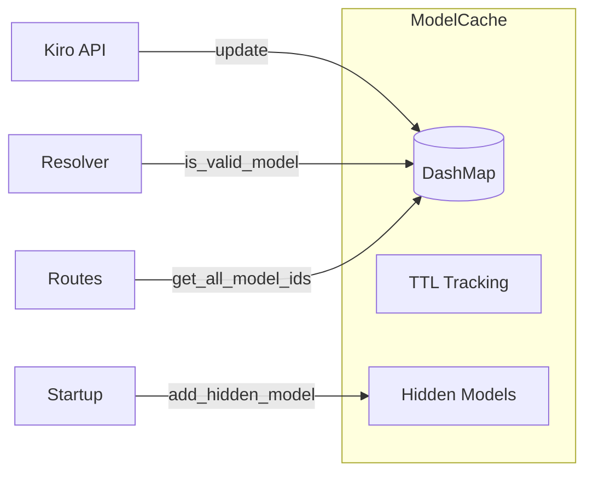

**Key Types:**

```rust
pub struct ModelCache {
    cache: Arc<DashMap<String, Value>>,  // Model data by ID
    last_update: Arc<DashMap<(), u64>>,  // Update timestamp
    cache_ttl: u64,                       // TTL in seconds
}
```

**Key Methods:**

| Method | Description |
|--------|-------------|
| `new(ttl)` | Create cache with TTL |
| `update(models)` | Replace cache contents |
| `is_valid_model(id)` | Check if model exists |
| `add_hidden_model(display, internal)` | Add alias mapping |
| `get_max_input_tokens(id)` | Get model's token limit |
| `is_stale()` | Check if cache needs refresh |

---

### 5. Model Resolver

**Source:** `src/resolver.rs`

**Overview:** Normalizes model names and resolves them to internal Kiro IDs through a multi-stage pipeline.

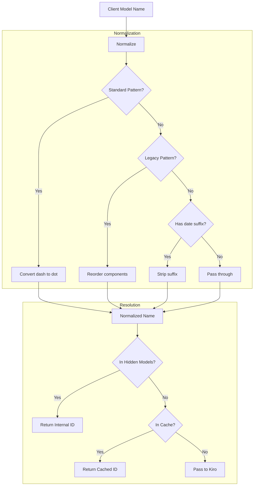

**Normalization Examples:**

| Input | Output |
|-------|--------|
| `claude-haiku-4-5` | `claude-haiku-4.5` |
| `claude-sonnet-4-5-20251001` | `claude-sonnet-4.5` |
| `claude-3-7-sonnet` | `claude-3.7-sonnet` |
| `claude-sonnet-4-latest` | `claude-sonnet-4` |

**Key Types:**

```rust
pub struct ModelResolution {
    pub internal_id: String,      // ID for Kiro API
    pub source: String,           // "cache", "hidden", "passthrough"
    pub original_request: String, // Client's original request
    pub normalized: String,       // After normalization
    pub is_verified: bool,        // Found in cache/hidden
}
```

---

### 6. Authentication

**Source:** `src/auth/`

**Overview:** Manages OAuth token lifecycle with automatic refresh, reading credentials from kiro-cli's SQLite database.

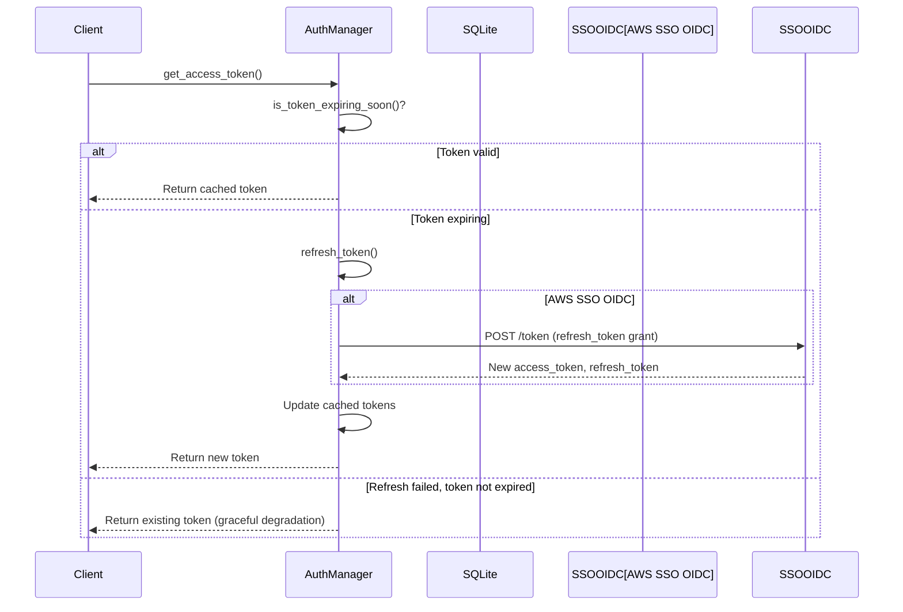

**Module Structure:**

| File | Description |
|------|-------------|
| `mod.rs` | Module exports |
| `manager.rs` | `AuthManager` - token lifecycle management |
| `credentials.rs` | SQLite credential loading |
| `refresh.rs` | Token refresh logic with retry |
| `types.rs` | Data structures |

**Key Types:**

```rust
pub enum AuthType {
    KiroDesktop,  // Kiro IDE auth (not used)
    AwsSsoOidc,   // AWS SSO OIDC (kiro-cli)
}

pub struct Credentials {
    pub refresh_token: String,
    pub access_token: Option<String>,
    pub expires_at: Option<DateTime<Utc>>,
    pub region: String,
    pub client_id: Option<String>,
    pub client_secret: Option<String>,
    // ...
}

pub struct AuthManager {
    credentials: Arc<RwLock<Credentials>>,
    access_token: Arc<RwLock<Option<String>>>,
    expires_at: Arc<RwLock<Option<DateTime<Utc>>>>,
    refresh_threshold: i64,  // Seconds before expiry
    // ...
}
```

---

### 7. HTTP Client

**Source:** `src/http_client.rs`

**Overview:** HTTP client wrapper with connection pooling, automatic retry logic, and exponential backoff.

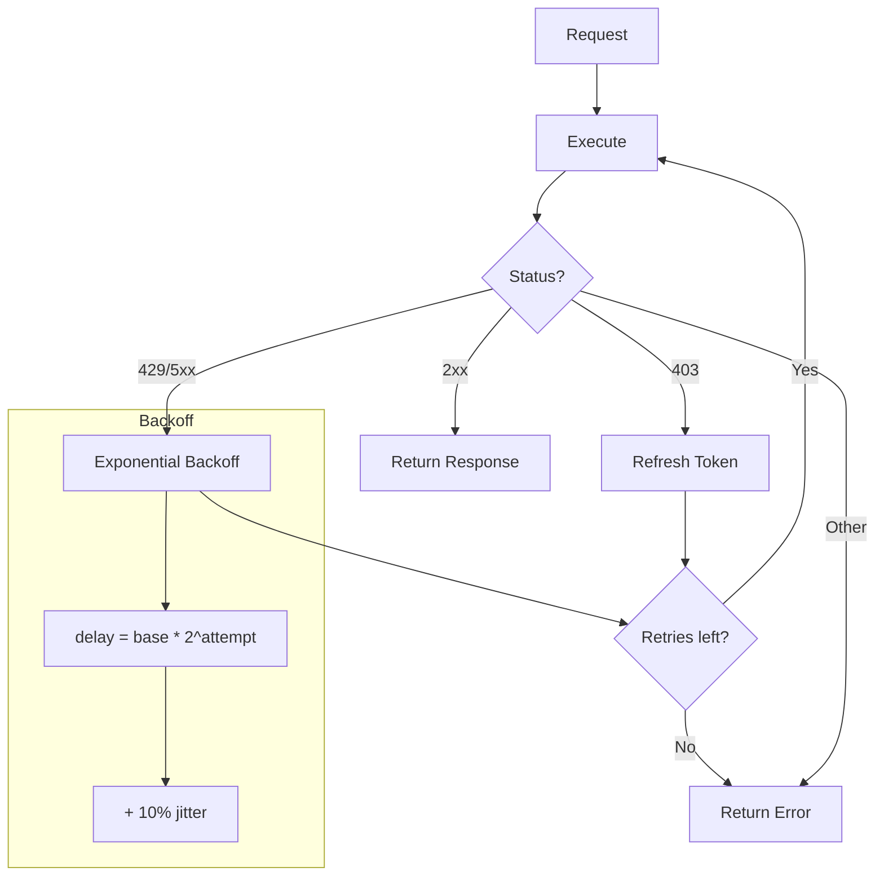

**Key Types:**

```rust
pub struct KiroHttpClient {
    client: Client,                    // reqwest client with pooling
    auth_manager: Arc<AuthManager>,
    max_retries: u32,
    base_delay_ms: u64,               // 1000ms default
}
```

**Key Methods:**

| Method | Description |
|--------|-------------|
| `new(...)` | Create client with connection pool |
| `request_with_retry(req)` | Execute with retry logic |
| `request_no_retry(req)` | Execute without retries (startup) |
| `calculate_backoff_delay(attempt)` | Exponential backoff with jitter |

---

### 8. Routes

**Source:** `src/routes/mod.rs`

**Overview:** Axum HTTP handlers for OpenAI and Anthropic API endpoints.

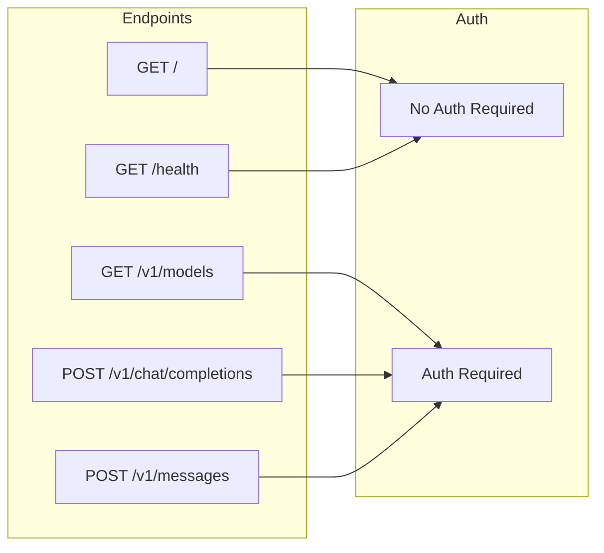

**AppState:**

```rust
pub struct AppState {
    pub proxy_api_key: String,
    pub model_cache: ModelCache,
    pub auth_manager: Arc<AuthManager>,
    pub http_client: Arc<KiroHttpClient>,
    pub resolver: ModelResolver,
    pub config: Arc<Config>,
}
```

**Endpoints:**

| Endpoint | Method | Auth | Description |
|----------|--------|------|-------------|
| `/` | GET | No | Simple health check |
| `/health` | GET | No | Detailed health with timestamp |
| `/v1/models` | GET | Yes | List available models (OpenAI format) |
| `/v1/chat/completions` | POST | Yes | OpenAI Chat Completions API |
| `/v1/messages` | POST | Yes | Anthropic Messages API |

---

### 9. Streaming

**Source:** `src/streaming/mod.rs`

**Overview:** Parses Kiro's AWS Event Stream format and converts to OpenAI/Anthropic SSE formats.

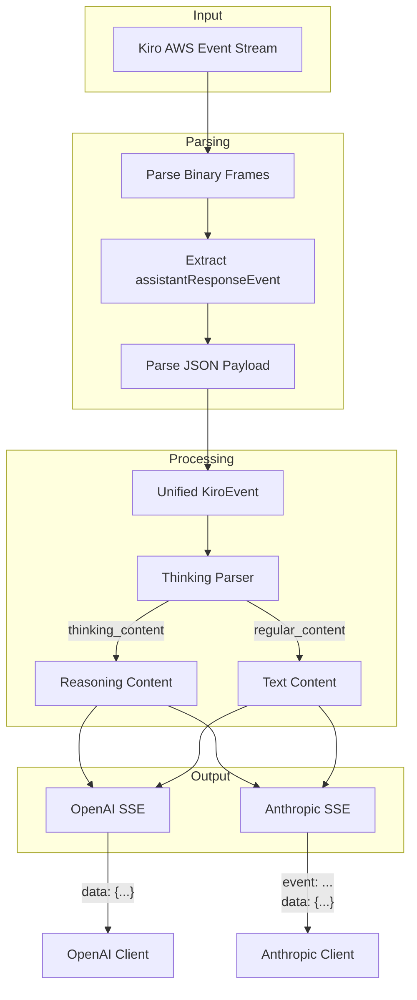

**Key Types:**

```rust
pub struct KiroEvent {
    pub event_type: String,           // content, thinking, tool_use, usage
    pub content: Option<String>,
    pub thinking_content: Option<String>,
    pub tool_use: Option<ToolUse>,
    pub usage: Option<Usage>,
    pub is_first_thinking_chunk: bool,
    pub is_last_thinking_chunk: bool,
}

pub struct Usage {
    pub input_tokens: i32,
    pub output_tokens: i32,
}
```

**Key Functions:**

| Function | Description |
|----------|-------------|
| `stream_kiro_to_openai()` | Convert stream to OpenAI SSE |
| `stream_kiro_to_anthropic()` | Convert stream to Anthropic SSE |
| `collect_openai_response()` | Aggregate stream to single response |
| `collect_anthropic_response()` | Aggregate stream to single response |
| `parse_aws_event_stream()` | Parse binary AWS Event Stream |

---

### 10. Thinking Parser

**Source:** `src/thinking_parser.rs`

**Overview:** Finite state machine that extracts `<thinking>` blocks from streaming content for extended thinking support.

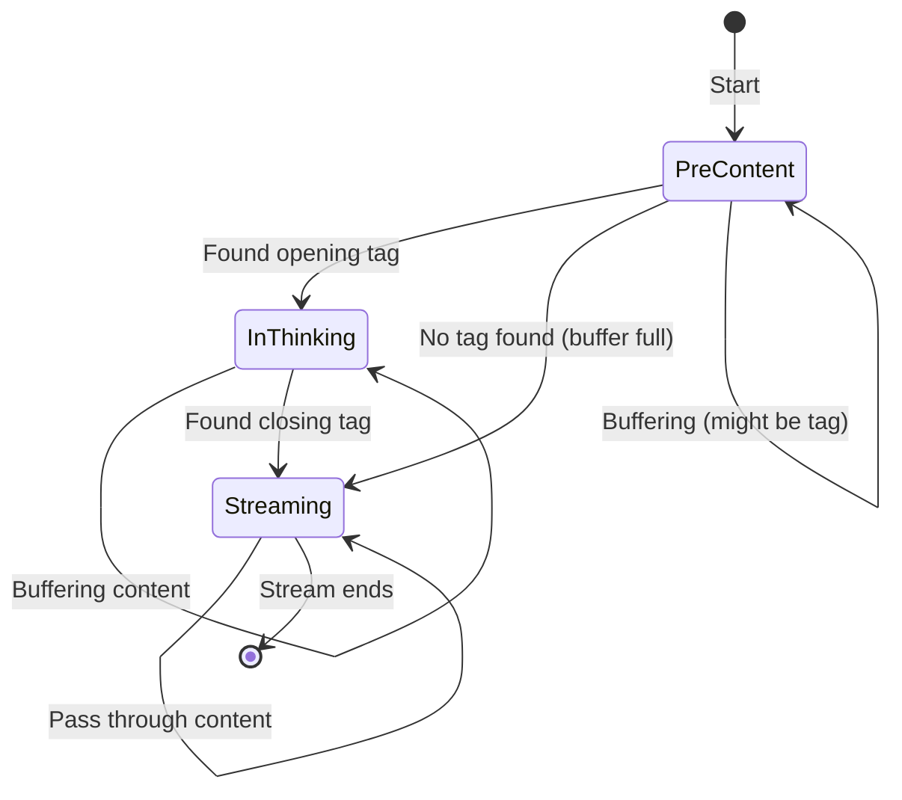

**Supported Tags:**
- `<thinking>...</thinking>`
- `<think>...</think>`
- `<reasoning>...</reasoning>`
- `<thought>...</thought>`

**Key Types:**

```rust
pub enum ParserState {
    PreContent,   // Looking for opening tag
    InThinking,   // Inside thinking block
    Streaming,    // Regular content streaming
}

pub struct ThinkingParseResult {
    pub thinking_content: Option<String>,
    pub regular_content: Option<String>,
    pub is_first_thinking_chunk: bool,
    pub is_last_thinking_chunk: bool,
    pub state_changed: bool,
}

pub struct ThinkingParser {
    pub handling_mode: String,  // as_reasoning_content, remove, pass, strip_tags
    pub state: ParserState,
    pub initial_buffer: String,
    pub thinking_buffer: String,
    // ...
}
```

**Handling Modes:**

| Mode | Description |
|------|-------------|
| `as_reasoning_content` | Extract to `reasoning_content` field |
| `remove` | Remove thinking block completely |
| `pass` | Keep original tags in output |
| `strip_tags` | Remove tags but keep content |

---

### 11. Tokenizer

**Source:** `src/tokenizer.rs`

**Overview:** Token counting using tiktoken (cl100k_base) with Claude correction factor for accurate input token estimation.

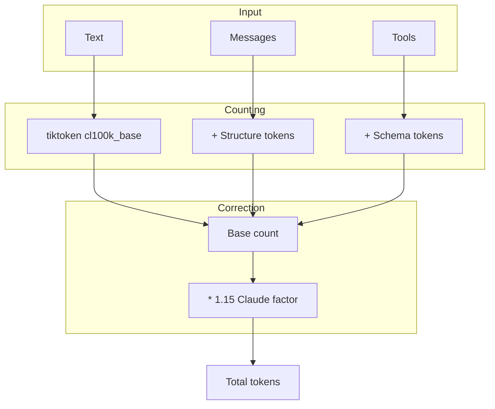

**Constants:**

| Constant | Value | Description |
|----------|-------|-------------|
| `CLAUDE_CORRECTION_FACTOR` | 1.15 | Claude tokenizes ~15% more than GPT-4 |
| `TOKENS_PER_MESSAGE` | 4 | Service tokens per message |
| `TOKENS_PER_TOOL` | 4 | Service tokens per tool |
| `TOKENS_PER_IMAGE` | 100 | Approximate tokens per image |

**Key Functions:**

| Function | Description |
|----------|-------------|
| `count_tokens(text, apply_correction)` | Count tokens in text |
| `count_message_tokens(messages, apply_correction)` | Count OpenAI message tokens |
| `count_tools_tokens(tools, apply_correction)` | Count tool definition tokens |
| `count_anthropic_message_tokens(messages, system, tools)` | Count Anthropic tokens |

---

### 12. Converters

**Source:** `src/converters/`

**Overview:** Bidirectional format conversion between OpenAI/Anthropic and Kiro API formats.

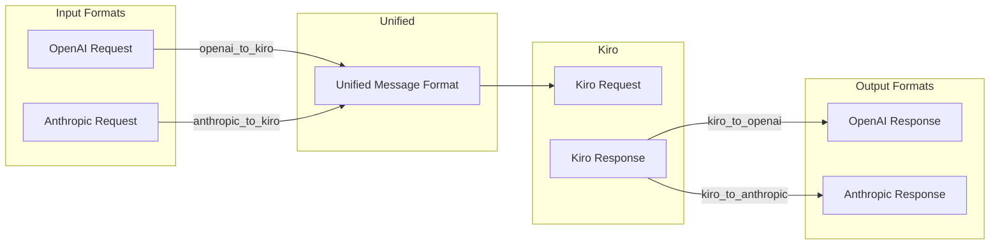

**Module Structure:**

| File | Description |
|------|-------------|
| `core.rs` | Unified message types |
| `openai_to_kiro.rs` | OpenAI -> Kiro conversion |
| `anthropic_to_kiro.rs` | Anthropic -> Kiro conversion |
| `kiro_to_openai.rs` | Kiro -> OpenAI conversion |
| `kiro_to_anthropic.rs` | Kiro -> Anthropic conversion |

**Conversion Responsibilities:**

| Converter | Handles |
|-----------|---------|
| `openai_to_kiro` | System prompt extraction, message roles, tool calls, images |
| `anthropic_to_kiro` | System blocks, content arrays, tool_use/tool_result |
| `kiro_to_openai` | SSE format, delta chunks, usage stats, tool calls |
| `kiro_to_anthropic` | Event types, content blocks, thinking blocks |

---

### 13. Data Models

**Source:** `src/models/`

**Overview:** Type definitions for OpenAI, Anthropic, and Kiro API formats.

**Module Structure:**

| File | Description |
|------|-------------|
| `openai.rs` | OpenAI API types |
| `anthropic.rs` | Anthropic API types |
| `kiro.rs` | Kiro/CodeWhisperer types |

**OpenAI Types (`models/openai.rs`):**

```rust
pub struct ChatCompletionRequest {
    pub model: String,
    pub messages: Vec<ChatMessage>,
    pub stream: bool,
    pub tools: Option<Vec<Tool>>,
    pub temperature: Option<f32>,
    pub max_tokens: Option<i32>,
    // ...
}

pub struct ChatMessage {
    pub role: String,
    pub content: Option<Value>,
    pub tool_calls: Option<Vec<ToolCall>>,
    pub tool_call_id: Option<String>,
}
```

**Anthropic Types (`models/anthropic.rs`):**

```rust
pub struct AnthropicMessagesRequest {
    pub model: String,
    pub messages: Vec<AnthropicMessage>,
    pub max_tokens: i32,
    pub system: Option<Value>,
    pub stream: bool,
    pub tools: Option<Vec<AnthropicTool>>,
    // ...
}

pub struct AnthropicMessage {
    pub role: String,
    pub content: Value,  // String or array of content blocks
}
```

---

### 14. Middleware

**Source:** `src/middleware/`

**Overview:** Request processing layers for authentication, CORS, and debug logging.

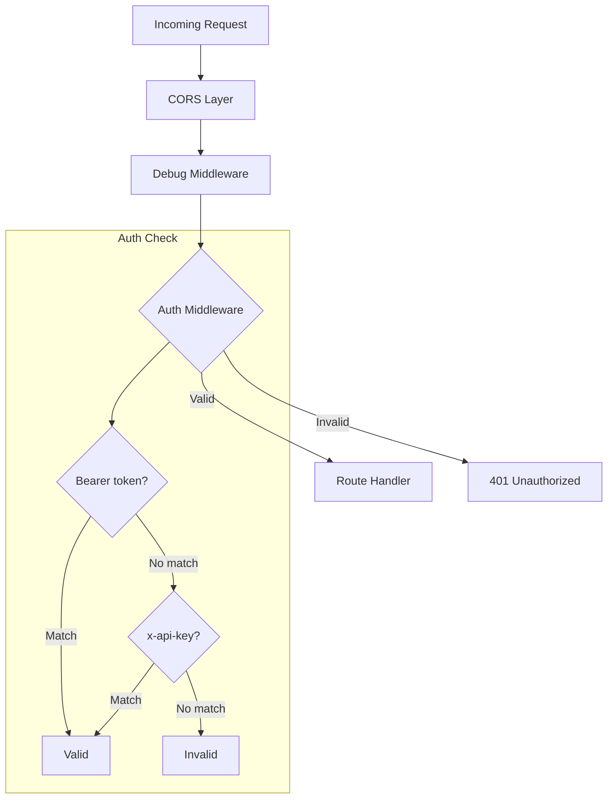

**Module Structure:**

| File | Description |
|------|-------------|
| `mod.rs` | Auth middleware, CORS layer |
| `debug.rs` | Debug logging middleware |

**Key Functions:**

| Function | Description |
|----------|-------------|
| `auth_middleware()` | Validates `Authorization: Bearer` or `x-api-key` |
| `cors_layer()` | Creates permissive CORS layer (allow all) |
| `debug_middleware()` | Logs requests/responses based on debug mode |

**Authentication:**
- Accepts `Authorization: Bearer {PROXY_API_KEY}`
- Accepts `x-api-key: {PROXY_API_KEY}`
- Returns 401 if neither matches

---

## Quick Reference

### Source Files

| File | Lines | Description |
|------|-------|-------------|
| `src/main.rs` | ~315 | Application entry point |
| `src/config.rs` | ~355 | Configuration management |
| `src/error.rs` | ~210 | Error types |
| `src/cache.rs` | ~205 | Model cache |
| `src/resolver.rs` | ~295 | Model name resolution |
| `src/auth/manager.rs` | ~275 | Token management |
| `src/http_client.rs` | ~230 | HTTP client with retry |
| `src/routes/mod.rs` | ~635 | HTTP handlers |
| `src/streaming/mod.rs` | ~2000+ | Stream parsing |
| `src/thinking_parser.rs` | ~645 | Thinking block extraction |
| `src/tokenizer.rs` | ~695 | Token counting |
| `src/middleware/mod.rs` | ~400 | Auth and CORS |

### Environment Variables

| Variable | Required | Default | Description |
|----------|----------|---------|-------------|
| `PROXY_API_KEY` | Yes | - | Client authentication key |
| `KIRO_CLI_DB_FILE` | Yes | - | Path to kiro-cli SQLite DB |
| `KIRO_REGION` | No | `us-east-1` | AWS region |
| `SERVER_HOST` | No | `0.0.0.0` | Bind address |
| `SERVER_PORT` | No | `8000` | Bind port |
| `LOG_LEVEL` | No | `info` | Log level |
| `DEBUG_MODE` | No | `off` | Debug mode (off/errors/all) |
| `FAKE_REASONING` | No | `true` | Enable extended thinking |
| `HTTP_MAX_RETRIES` | No | `3` | Max retry attempts |

### API Endpoints

| Endpoint | Method | Auth | Format |
|----------|--------|------|--------|
| `/` | GET | No | JSON |
| `/health` | GET | No | JSON |
| `/v1/models` | GET | Yes | OpenAI |
| `/v1/chat/completions` | POST | Yes | OpenAI |
| `/v1/messages` | POST | Yes | Anthropic |

### External Dependencies

| Service | URL Pattern | Purpose |
|---------|-------------|---------|
| Kiro API | `codewhisperer.{region}.amazonaws.com` | LLM inference |
| Q API | `q.{region}.amazonaws.com` | Model listing |
| AWS SSO OIDC | `oidc.{region}.amazonaws.com` | Token refresh |
